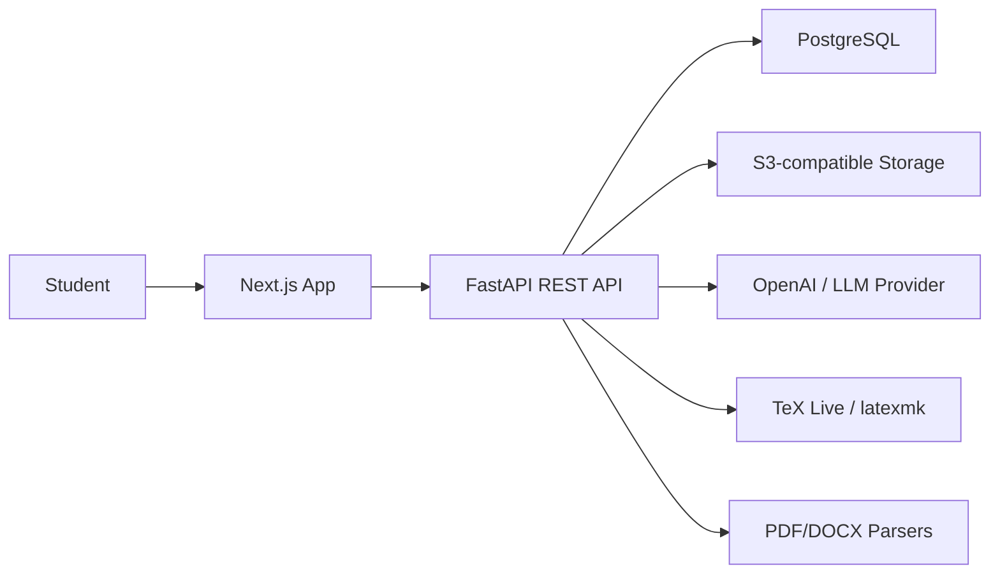

# ReportAI Architecture

## System Overview

ReportAI uses a split frontend/backend architecture. The Next.js application owns the SaaS user experience, dashboards, upload wizards, live editor, and report preview. FastAPI owns authentication, persistence, document analysis, AI orchestration, LaTeX generation, PDF compilation, and storage.

## Bounded Contexts

- Identity: users, password hashes, JWT access tokens, password reset hooks.
- Projects: project metadata, uploaded files, generated reports, report versions.
- Template Learning: uploaded source documents, extracted structure, formatting profile, citation profile.
- Questionnaire: domain-aware adaptive questions and answers.
- Generation: chapter content, citations, BibTeX, diagrams, LaTeX, and PDF artifacts.
- Quality: grammar, readability, technical depth, formatting, and citation scoring.

## Report Generation Pipeline

1. User creates a project and uploads previous reports, DOCX files, or university guidelines.
2. Backend stores raw files in S3-compatible storage and metadata in PostgreSQL.
3. Document processors extract text, headings, layout hints, and references.
4. Template learner normalizes the result into a reusable JSON template profile.
5. Questionnaire engine selects domain-specific questions and records answers.
6. AI content service generates sections with citations and adjustable depth.
7. LaTeX generator renders `report.tex`, `references.bib`, diagrams, and assets.
8. PDF compiler runs `latexmk` and stores the resulting PDF and logs.
9. Quality analyzer scores the finished report and returns suggestions.

## Database Model

- `users`: authentication and profile.
- `projects`: user-owned workspaces for a report.
- `files`: uploaded PDFs, DOCX files, guidelines, generated assets.
- `templates`: learned structure and formatting JSON.
- `questionnaires`: generated questions and answers per project.
- `generated_content`: generated chapter content and metadata.
- `references`: citations, DOI/URL metadata, and BibTeX.
- `reports`: LaTeX, PDF, compile logs, quality score, and export state.

## Security

- Passwords are hashed with bcrypt.
- JWTs are signed with `JWT_SECRET_KEY` and short-lived by default.
- Every project-scoped route validates ownership in the API layer.
- File storage keys are server-generated and never trusted from clients.
- OpenAI prompts are isolated in services so policy, rate limits, and moderation can be enforced centrally.

## Scalability Notes

- Move long-running template learning, generation, compilation, and quality analysis to a worker queue such as Celery/RQ/Arq for production traffic.
- Use presigned uploads for large files.
- Keep generated report versions immutable for reproducibility.
- Store LaTeX compilation logs for debugging and AI repair loops.
